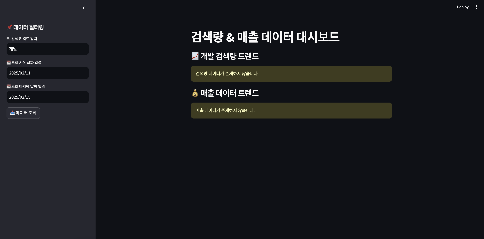
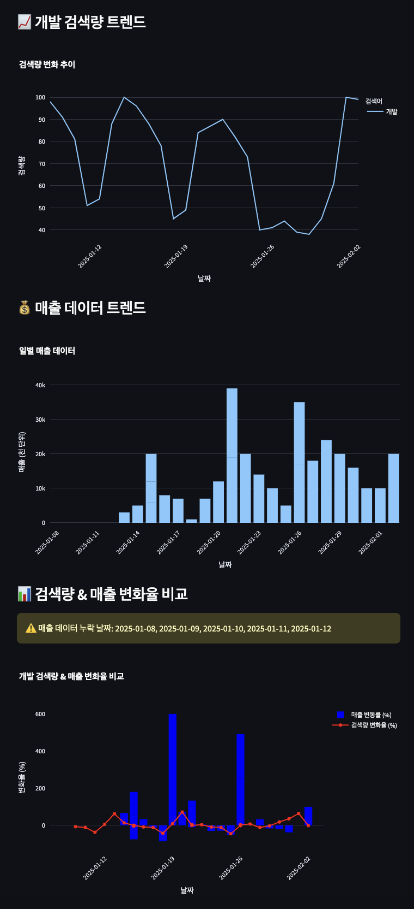

# 🚀 마케팅 데이터 & 매출 분석 대시보드
> Naver DataLab에서 검색량 데이터를 수집하고, 매출 데이터를 업로드하여 한눈에 분석할 수 있도록 돕는 대시보드입니다.


## 📌 프로젝트 목표
- Naver DataLab에서 키워드 검색량을 자동으로 크롤링
- 매출 데이터를 업로드하여 검색량과 비교 분석
- 검색량 및 매출 변화율 비교 분석
- FastAPI로 백엔드 API 제공
- Streamlit을 이용한 대시보드 시각화
---
## 🛠️ 기술 스택
- **백엔드:** FastAPI, SQLAlchemy, PostgreSQL
- **웹 크롤링:** Naver DataLab API
- **데이터 처리:** Pandas (데이터 분석), Polars (파일 업로드)
- **프론트엔드:** Streamlit (웹 애플리케이션), Plotly (데이터 시각화)
---
## 📊 주요 기능
1. 검색량 및 매출 데이터 수집
- 네이버 DataLab에서 검색량 크롤링
- 매출 데이터를 CSV 또는 단일 입력 방식으로 업로드
2. 검색량 및 매출 비교 분석
- 특정 키워드의 검색량 및 매출 데이터를 조회
- 검색량과 매출의 변동률(%)을 계산하여 비교
3. 데이터 시각화 (Streamlit)
- 검색량 및 매출 데이터를 차트로 제공
- 검색량 및 매출의 일별 변화율을 비교 차트로 제공
---
## 📡 API 엔드포인트

### 검색량 데이터 (Marketing)

| 메서드 | 엔드포인트 | 설명 |
| --- | --- | --- |
| `GET` | `/marketing/search-volume` | 특정 키워드의 검색량 데이터 조회 |
| `POST` | `/marketing/search-volume` | 특정 키워드의 검색량 데이터를 크롤링하여 저장 |
| `GET` | `/marketing/search-volume-trend` | 최근 7일 vs 이전 7일 검색량 증가율 분석 |

### 매출 데이터 (Sales)

| 메서드 | 엔드포인트 | 설명 |
| --- | --- | --- |
| `GET` | `/sales` | 저장된 매출 데이터 조회 |
| `POST` | `/sales` | 단일 매출 데이터 저장 |
| `POST` | `/sales/files` | CSV 파일을 업로드하여 매출 데이터 저장 |

### 검색량 & 매출 변화율 비교 분석 (Analytics)

| 메서드 | 엔드포인트 | 설명 |
| --- | --- | --- |
| `GET` | `/analytics/marketing-sales` | 특정 기간의 검색량 및 매출 변화율 비교 |

---
## 📝 CSV 업로드 가이드
> CSV 파일을 업로드하여 대량의 매출 데이터를 한 번에 저장할 수 있습니다. 파일 내 데이터는 유효성 검증 후에 저장되며, 중복된 날짜의 데이터는 업데이트에서 제외됩니다.

### 매출 데이터 CSV 형식 예시
| date | revenue |
| --- | --- |
| 2024-01-01 | 150000 |
| 2024-01-02 | 180000 |
| 2024-01-03 | 120000 |
- `date` 컬럼은 YYYY-MM-DD 형식 (매출 일자)
- `revenue` 컬럼은 정수 값 (매출 금액)

### CSV 데이터 검증 및 예외 처리
> CSV 업로드 시 데이터 유효성 검사를 수행하며, 다음과 같은 예외 처리가 포함됩니다.  

#### 검증 종류
| 검증 항목 | 설명 | 예외 처리 |
| --- | --- | --- |
| **날짜 형식** | `YYYY-MM-DD` 형식인지 확인 | `400 Bad Request` |
| **존재하지 않는 날짜** | `2024-02-30` 같은 유효하지 않은 날짜 확인 | `400 Bad Request`  |
| **매출 값** | `revenue` 값이 `0보다 큰 정수`인지 확인 | `400 Bad Request` |
| **CSV 내부 중복 데이터** | CSV 파일 내 같은 날짜가 두 번 이상 있는 경우 | `400 Bad Request` |
| **이미 존재하는 데이터** | DB에 같은 날짜의 데이터가 존재하는 경우 | 예외 처리 하지 않고, **새로운 데이터만 저장 & 제외된 날짜 목록 반환** |

#### CSV 업로드 시 응답 예시 
✅ **새롭게 추가된 데이터가 있고, 일부 날짜가 중복된 경우**
```json
{
  "message": "✅ 2개의 새로운 매출 데이터가 성공적으로 저장되었습니다.",
  "skipped_dates": ["2024-01-01", "2024-01-02"]
}
```
✅ **모든 날짜가 이미 존재하여 새로운 데이터가 없는 경우**
```json
{
  "message": "❌ 모든 날짜의 데이터가 이미 존재합니다. 새로 업데이트한 데이터가 없습니다.",
  "skipped_dates": ["2024-01-01", "2024-01-02", "2024-01-03"]
}
```
✅ **CSV 내부에 중복된 날짜가 포함된 경우**
```json
{
  "error": "400: CSV 파일에 중복된 날짜 데이터가 포함되어 있습니다."
}
```

---
## 🚀 실행 방법
1. **가상 환경 설정**
```bash
python -m venv venv
source venv/bin/activate  # Mac/Linux
venv\Scripts\activate  # Windows
```

2. **필요한 패키지 설치**
```bash
pip install -r requirements.txt
```

3. **FastAPI 실행**
```bash
uvicorn backend.app.main:app --reload
```

4. **API 문서 확인 (Swagger UI)**
➡️ 브라우저에서 http://127.0.0.1:8000/docs 접속

5. **Streamlit 실행**
```bash
streamlit run streamlit_app.py
```

---

## 🎨 대시보드 미리보기
> 특정 키워드 검색량 트렌드와 매출 데이터를 분석하여 시각적으로 표현합니다. 각 그래프는 검색량과 매출 변화, 그리고 두 데이터 간의 상관관계를 보여줍니다.  


- 왼쪽 상단 사이드바에서 검색량을 조회할 키워드와 기간을 지정한 후 '데이터조회'를 클릭
- 조회를 요청한 기간에 데이터가 없는 경우, 오른쪽 화면에서 경고 알림을 표시


- 검색량 트랜드는 라인 그래프, 매출 데이터 트렌드는 막대 그래프로 등락 패턴을 확인 가능
- 요청 기간 중 데이터가 누락된 날짜는 차트에 표현되지 않으며 경고 알림을 표시
